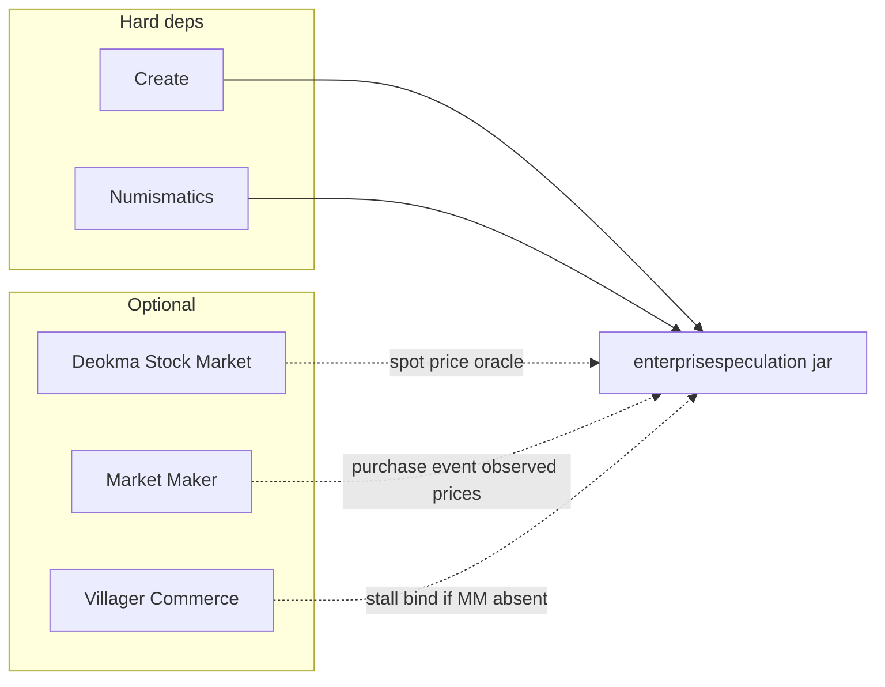
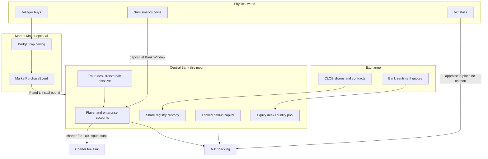

# Create: Enterprise Speculation — Build Plan

**Repo:** `Create- Enterprise Speculation`  
**Mod id (proposed):** `enterprisespeculation`  
**Display name:** Create: Enterprise Speculation  
**Sibling (do not implement MM inside this repo):** `../Create- Market Maker` (`marketcoordination`)

This document is the source of truth for this workspace. Market Maker remains the NPC-demand governor. This mod owns the Central Bank, chartered enterprises, NAV-backed equity, a capped Equity Desk, fraud controls, and cash-settled commodity futures/options.

---

## Why a separate repository

Market Maker (`marketcoordination`) layers budgets, caps, ceilings, and growth on **Create: Villager Commerce**. Its hot path is villager `canPurchase`. Folding a bank, CLOB, and fraud desk into that jar would:

- Force finance on servers that only want NPC budgets
- Couple this release cadence to MM v0.4
- Tempt work onto the villager tick
- Make Numismatics/Stock Market the center of a VC-gating mod

This repo is a **standalone NeoForge 1.21.1 mod**. Hard-depend on Create + Numismatics. Optional-depend on Deokma Stock Market, Market Maker, and Villager Commerce. **MM must never depend on this mod.**



Until MM publishes events, this mod may use a **narrow** VC stall mixin for bind/P&L. If both MM and VC are absent, enterprises are cash-only NAV (PIC + treasury, no stall appraisal).

Keep Deokma as the **spot oracle**. Do not adopt KROIA StockMarket’s virtual item bank (no teleport / no virtual item inventories).

---

## Companion work in Market Maker (other repo)

Ask the MM workspace to add a **tiny public surface** only. Do not vendor MM sources here.

1. `MarketPurchaseEvent` from `VcIntegration.onPurchaseRecorded` — market id, stall pos, item, qty, spurCost. This mod listens when MM is loaded.
2. `SellerIdentityLookup` SPI — this mod registers “stall → enterpriseId”; MM uses it in `sellerIdentity` when present.
3. Optional read of MM `ObservedPriceIndex` as an oracle fallback.

MM paths for the other agent:

- `../Create- Market Maker/src/main/java/com/bng/marketcoordination/integration/vc/VcIntegration.java`
- `../Create- Market Maker/src/main/java/com/bng/marketcoordination/economy/ObservedPriceIndex.java`
- `../Create- Market Maker/docs/integration-map.md` (Deokma SM: `by.deokma.stockmarket.market`)

Copy Gradle/NeoForge pins from MM `gradle.properties` (MC 1.21.1, NeoForge 21.1.248, Create 6.0.10-280, Numismatics 1.0.20). Do not copy VC mixins wholesale.

---

## Product

A server **Central Bank** charters enterprises for a fee, holds cash and share custody, enforces **NAV backing** on listed stocks, runs a **capped Equity Desk** for noise, and freezes **bank-held** claims on fraud. Commodity futures/options are **cash-settled** against the spot oracle.

Player-to-player trades are zero-sum. The Bank issues or sinks currency only through capped pools (charter fees in; desk losses out), tracked in **this** mod’s ledger — never mixed into MM commodity issuance. Paper volume must not grow MM activity scores.



### Design rules (non-negotiable)

- **No teleport, no virtual item inventories.** Bank holds **spurs and share registry entries** only. Stall goods stay in the world. Dissolve pays **bank-held cash**, never yanks chests or stall stock.
- **Cash-settled derivatives.** Expiry pays spur differences vs the oracle. No warehouse receipts in v1.
- **Fully collateralized.** Halt the instrument rather than mint to pay a winner.
- **Stocks must be backed** by haircutted NAV. Paper companies cannot float unbounded shares.
- **Hot path stays cold.** No inject into VC `canPurchase`. Matching, audits, and mark-to-market are player UI or a **finance-owned** day-cycle stagger.
- **Two jars, one pack.** Disable this mod and MM still runs. Disable MM and this mod still banks (weaker stall NAV).

---

## Package layout (this repo, after scaffold)

- `bank/` — Central Bank singleton, accounts, charter sink, equity-desk pool, fraud desk
- `enterprise/` — legal entity, PIC, bound stalls, books
- `exchange/` — instruments, orders, matching, circuit breakers
- `clearing/` — margin, variation, expiry, liquidation
- `integration/numismatics/`, `integration/stockmarket/`, `integration/marketcoord/`, `integration/vc/`
- Blocks: **Bank Window** (deposit/withdraw/charter), **Exchange Terminal** (orders, NAV, positions)
- Commands: `/espec` (or `/enterprise`) — not `/marketcoord`
- Config: `enterprisespeculation-common.toml`

Core packages must not import VC/SM/MM types; adapters only.

### 1. Central Bank

One server-authoritative `CentralBank` SavedData.

Physical coins enter/leave only at a **Bank Window** (player standing there, inventory transfer).

- Collect **charter fees** (default `100_000` spurs ≈ 1,562 Cogs / ~24 Suns if Cog = 64; `charter_fee_spurs`)
- Custody **all listed shares** (registry; no duplicateable certificate items in v1)
- Hold **locked paid-in capital** and free treasury
- Hold **derivative margin**
- Run a **capped Equity Desk**
- **Freeze / halt / dissolve** using only books it already holds

**Charter:** founder must have ≥ fee + minimum PIC in their personal Bank account, then:

1. Sink `charter_fee_spurs` into `charterFeeSink`
2. Move `minimum_paid_in_capital_spurs` (default 50_000) into enterprise **locked PIC** — withdrawable only on dissolve or after going private
3. Issue `authorizedShares` to the founder in Bank custody
4. Reserve ticker + name

No fee, no company. Optional rising fee for repeat charters from the same UUID.

### 2. Enterprise

- `EnterpriseId`, ticker, display name, founder, officers
- Bank sub-accounts: `lockedPicSpurs`, `freeTreasurySpurs`
- Bound stalls with **proof of control**
- P&L from `MarketPurchaseEvent` (or VC mixin fallback) when bound. Physical coins still land in the stall. Officers haul coins to a Bank Window. **NAV does not assume stall cash was deposited.**
- Dividends from **free treasury only**, never PIC, never paper P&L

Seller identity for MM: SPI returns `enterpriseId` for bound stalls.

### 3. Stock backing (NAV)

At day boundary (and cached before match / listing):

```text
appraisedGoods = sum(bound stall sale-item counts × oracle spurs × inventory_haircut)
navSpurs = lockedPic + freeTreasury + appraisedGoods
navPerShare = navSpurs / outstandingShares
marketCap = lastTradePrice × outstandingShares
```

- Stall goods haircut default `0.5` (they can walk away). PIC haircut `1.0`.
- Cannot list until PIC ≥ minimum and `min_bound_stalls` (e.g. 1) with a completed VC sale in the rolling window (or cash-only listing with stricter PIC if VC/MM absent).
- Cannot issue extra shares if NAV per share would fall below `min_nav_per_share`.
- If `marketCap > navSpurs × max_premium` (e.g. 3×): halt **buy** orders; Desk may only **sell**; flag `OVEREXTENDED`.
- Dissolve pays pro-rata **Bank cash only** (`lockedPic + freeTreasury`).
- Unloaded stalls do **not** inflate NAV (no chunk-load to peek). Stale last-known inventory gets an extra haircut or is ignored.

Oracle chain: SM daily cache → live Deokma `MarketData.get()` avg/min → MM `ObservedPriceIndex` if present → empty (that line counts 0 / commodity cannot list).

### 4. Equity CLOB + Bank-introduced fluctuations

Instrument: `SHARE:<ticker>`. Limit orders, price-time match, DvP (spurs vs custody shares). **No short stock in v1.**

**Equity Desk** (capped, pre-funded — same philosophy as MM NPC daily budgets):

- Pool seeded from `desk_fee_share` of charter fees (e.g. 0.25) plus optional daily refill cap
- At IPO, founder **must** sell `stabilization_float` (e.g. 10%) to the Desk at `navPerShare`
- Each Minecraft day, after oracle refresh:

```text
sentiment = clamp(prev + gaussian(0, sigma), -max_sentiment, +max_sentiment)
fair = navPerShare × (1 + sentiment)
quote bid/ask around fair with spread and max_lots_per_day
```

- Desk buys only with pool cash and only if `fair` is not above `nav × max_premium`
- Desk sells only shares it **owns** (no naked Bank short)
- Pool losses = tracked issuance; profits stay in the pool. At `desk_floor_spurs`, **quotes stop** — never mint
- Optional category-wide sentiment shocks (food tickers together, etc.)

No fake ticks: sentiment must hit the book through Desk quotes.

### 5. Fraud desk (no teleport enforcement)

The Bank can only punish **claims it already holds**. It cannot confiscate backpacks or stall iron.

**Prevention**

- Charter fee + PIC lock
- Stall bind: VC owner UUID if exposed, else Bank-issued **Charter Seal** item that must remain in that stall (audit flag, not a teleporter)
- Wash trades: reject if buyer/seller resolve to the same player, same enterprise, or an officer of the ticker
- Asset stripping: while `publicFloat > 0`, cap daily officer free-treasury withdrawals; PIC never leaves until dissolve
- Idle listing: zero rolling VC sales for `delist_idle_days` → halt + dissolve countdown (skip if cash-only listing)
- Circuit breaker: halt ticker for the day if last price moves more than `max_daily_move`

**Detection** (finance day-cycle, staggered; do not hitch villager ticks)

- Re-appraise **loaded** bound stalls only
- Officer withdrawals vs NAV drop vs vanished stall stock → `AUDIT_FLAG`

**Enforcement**

- `FREEZE` account: no withdraw, no new orders (deposits allowed)
- `HALT` ticker: cancel resting orders
- `DISSOLVE`: cancel orders, remaining Bank cash pro-rata to custody shareholders, tombstone entity. World items stay put
- Never: `/give`, teleport items, wipe stall BE, reach into player inventory

Admins: `/espec bank freeze|halt|audit|dissolve`

### 6. Commodity futures and options

Universe: items with an oracle (prefer MM `commodity_caps.json` list when MM is present; otherwise a finance data file).

- Contract size 64 (1 lot); tenors 1 / 7 / 28 Minecraft days
- **Futures:** daily mark-to-market vs oracle; cash settle at expiry; initial + maintenance margin in Bank accounts
- **Options:** European calls/puts; listed strikes ATM and ±10/25% at listing; premium up front; cash exercise `max(0,S-K)` / `max(0,K-S)`
- Own day-cycle handler after SM cache refresh — do not pile onto MM `MarketDayCycleHandler`

Equity Desk only in v1. Do not add a commodity MM until desk issuance is proven safe.

### 7. What we will not build in v1

- Physical delivery, bonded warehouses, KROIA item banks, world-item seizure
- Uncapped Bank market-making or Black-Scholes NPC options MM
- Stock shorts, American options, option-on-futures
- CLOB/Desk volume feeding MM growth
- Fake price ticks with no Desk trade
- This repo depending on MM as a **required** jar
- MM depending on this repo

---

## Config defaults

`[bank]`, `[enterprise]`, `[speculation]` in this mod’s config.

- `charter_fee_spurs = 100000`
- `minimum_paid_in_capital_spurs = 50000`
- `inventory_haircut = 0.5`
- `max_premium_over_nav = 3.0`
- `stabilization_float = 0.10`
- `desk_fee_share = 0.25`
- `max_sentiment = 0.15`
- `max_lots_per_ticker_per_day`, `desk_floor_spurs`
- `max_daily_move`, `delist_idle_days`, `max_daily_officer_withdraw_bps`

---

## Implementation sequence

Each phase should be shippable without the next.

**v0.1 Scaffold** — NeoForge 1.21.1 Gradle project (mirror MM pins), `enterprisespeculation` mod id, optional deps in `neoforge.mods.toml` (`stockmarket`, `marketcoordination`, `createvillagercommerce`), empty Bank SavedData stub, `/espec` ping command.

**v0.5 Bank + charter** — accounts, Bank Window coin I/O, fee sink, PIC lock, enterprise registry, stall bind + seal/owner proof, P&L listener (MM event or VC fallback).

**v0.6 Backed equity + Desk** — custody CLOB, NAV appraisal (loaded chunks only), listing rules, circuit breakers, IPO float to Desk, daily sentiment quotes, issuance/sink accounting.

**v0.6b Fraud desk** — wash reject, withdrawal caps, idle delist, freeze/halt/dissolve, admin commands, Bank UI flags.

**v0.7 Futures** — Bank-margined lots, day-cycle MTM/expiry.

**v0.8 Options** — European cash-settled calls/puts on the same clearing and Exchange Terminal.

---

## Todos

- [ ] v0.1 Scaffold NeoForge mod in this repository
- [ ] Coordinate MM `MarketPurchaseEvent` + `SellerIdentityLookup` in `Create- Market Maker` (other workspace)
- [ ] v0.5 Central Bank, charter fee, PIC, Bank Window, stall bind, P&L
- [ ] v0.6 Share CLOB, NAV backing, Equity Desk
- [ ] v0.6b Fraud desk (books only, no teleport)
- [ ] v0.7 Cash-settled commodity futures
- [ ] v0.8 European cash-settled options
