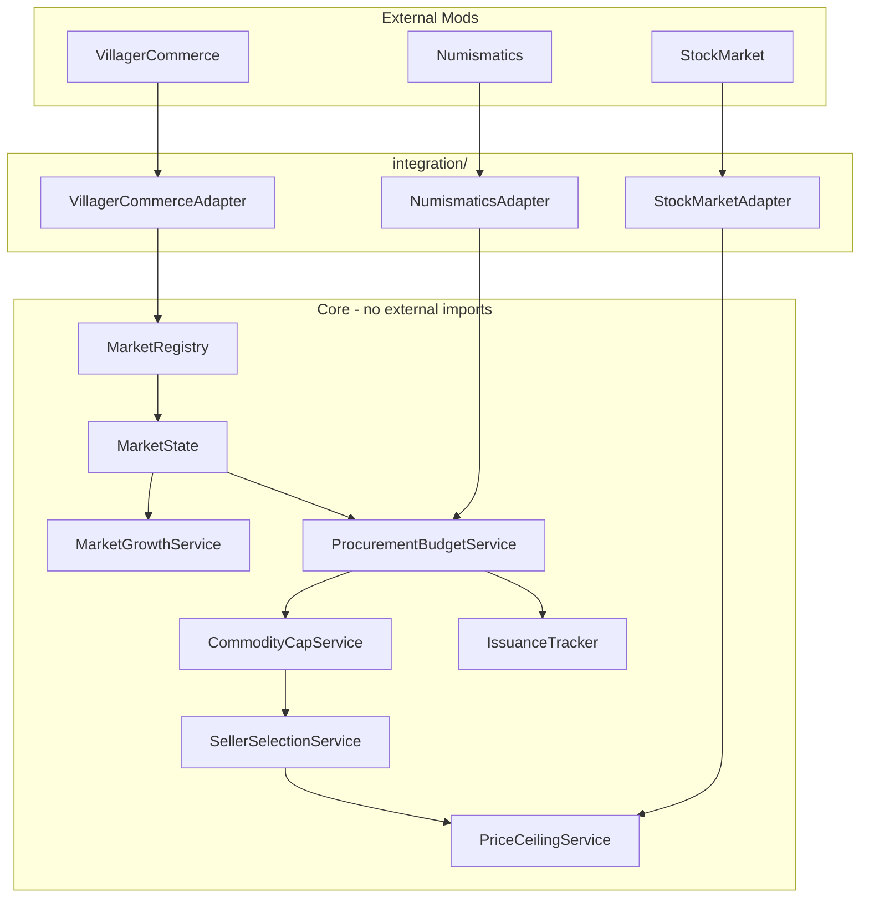
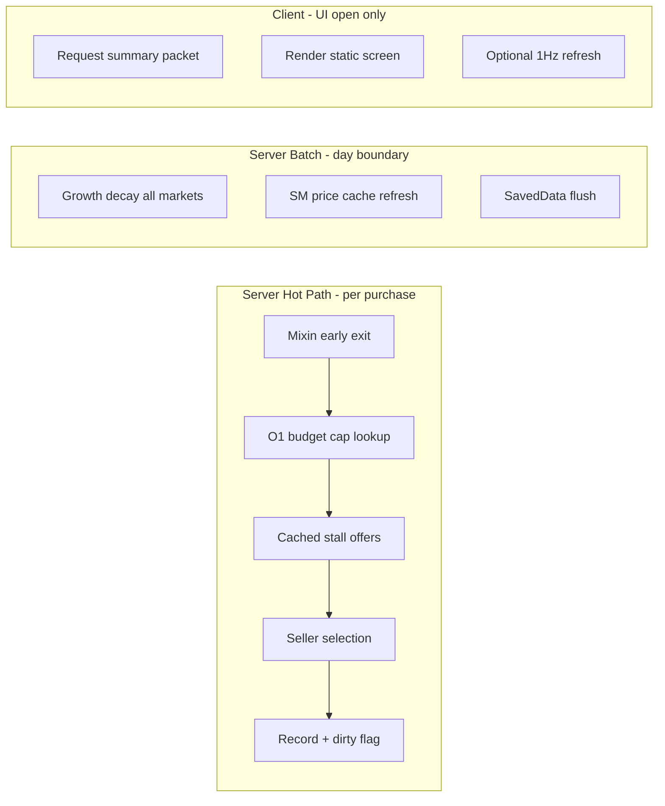
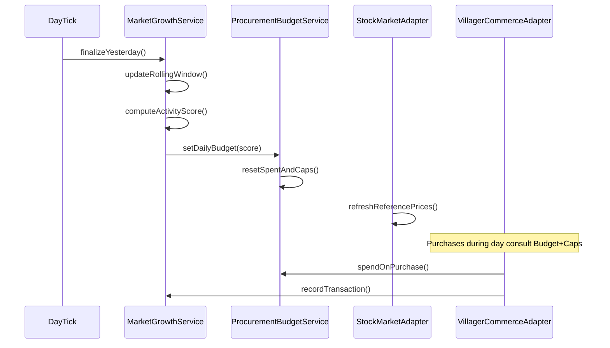

# Market Coordination Mod — Full Build Plan

## Current State

The repo is **greenfield**: only [brave_new_globe_market_growth_system.md](brave_new_globe_market_growth_system.md) (untracked) and `.gitattributes`. No Gradle project, Java sources, or mod metadata exist yet.

Target platform: **NeoForge 1.21.1** (Brave New Globe pack).

---

## Integration Strategy (Per-Mod)

Integration approach differs by dependency based on what is realistically available:

| Mod | Author | API plan | Integration approach |
|-----|--------|----------|----------------------|
| **Create: Villager Commerce** | BeakBock | **Assume no API** — outreach in progress; plan as if no response or negative | Mixins on purchase pipeline + stall/ledger BE accessors |
| **Stock Market** | KROIA | **Use plugin API if possible** — [documented plugin system](https://github.com/KROIA/StockMarket/tree/main/documentation/developer-guide/plugin-system) | Read-only `ServerPlugin` for price queries; accessor/mixin fallback |
| **Create: Numismatics** | Layers-of-Railways | **Required hard dep — use mod API** | `Coin`, `MergingCoinBag`/`DiscreteCoinBag`, `CoinItem`, `NumismaticsItems`; compile against CreateNumismatics JAR |
| **Create** | Creators-of-Create | N/A | compileOnly for block-type discovery if needed |

**Planning principle:** Core market logic never imports external mod classes. Adapters encapsulate all integration — whether API, mixin, or fallback.

**Villager Commerce:** VC already implements Market Ledgers, stall binding, villager registration, and its own daily purchase limits. This mod **layers server-authoritative economic state** on top via mixins. VC’s built-in daily cap is **neutralized** (mixin delegates to our budget).

**If BeakBock responds positively later:** Add a `VcApiAdapter` behind the same `VillagerCommerceAdapter` interface — do not rewrite core logic. Until then, mixins are the only VC path.

---

## Integration Detail (by mod)

### Villager Commerce — mixins + accessors (no API assumed)

Reverse-engineer JAR in Phase 0; target likely areas:

| Need | Technique |
|------|-----------|
| Identify Market Ledger | Lectern BE accessor: book title `"Market Ledger"`, first page line = market name; stable ID = `dimension + blockPos` |
| List stalls in market | Read VC stall BE linked-market field via accessor; fallback: radius scan for stall blocks + match ledger binding NBT |
| Enumerate offers | Accessor on stall BE: sale item, price stack, stock link, owner UUID |
| Intercept purchase | **Mixin `@Inject` cancellable** on VC purchase-attempt / seller-selection method; replace selection with our `SellerSelectionService` result |
| Record completed purchase | **Mixin `@Inject` at purchase success** tail; emit internal `MarketTransactionEvent` |
| Villager count | Accessor on ledger market record or mixin on registration list |
| Disable VC daily cap | **Mixin `@Redirect` or `@ModifyReturnValue`** on VC budget/limit check → consult `ProcurementBudgetService` |

Ship mixins in `integration/vc/mixin/` with a `VcVersionProbe` that logs warnings if expected class/method signatures drift between VC versions.

### Stock Market — plugin API primary, accessor fallback

KROIA publishes a [plugin system](https://github.com/KROIA/StockMarket/tree/main/documentation/developer-guide/plugin-system) with read APIs (`IPluginMarket.getPrice()`, `getDefaultRealPrice()`, order book sell orders). **Use this when it works.**

| Need | Primary (plugin API) | Fallback (no API) |
|------|---------------------|-------------------|
| Reference / low / avg price | Read-only `ServerPlugin`; cache at day boundary; **never mutate SM state** | Accessor/mixin read of internal price fields |
| Item → market mapping | Subscribe via `onMarketSubscribed` | SM registry accessor; config fallback map |
| Missing SM or item not listed | — | Config baseline × multiplier |
| Long-term resilience | — | **`ObservedPriceIndex`**: rolling median of our recorded VC purchase prices |

`StockMarketAdapter` selects backend at runtime:

```text
if (SmPluginBackend.probe()) → SmPluginBackend
else if (SmAccessorBackend.probe()) → SmAccessorBackend
else → ConfigBaselineBackend (+ ObservedPriceIndex when available)
```

Phase 0 validates plugin registration against the Brave New Globe Stock Market version before committing to it as primary.

### Numismatics — required dependency, use mod API

Numismatics is a **hard dependency** (server and client). All currency math uses Numismatics types directly via `NumismaticsAdapter`:

| Need | Numismatics API |
|------|-----------------|
| Denominations | `dev.ithundxr.createnumismatics.content.backend.Coin` enum — `.value` in spurs, `.toSpurs(count)`, `.getCoinsFromSpurAmount(spurs)` |
| Parse price stacks | `CoinItem` (`instanceof` on stack item → `coinItem.coin.toSpurs(count)`) or `MergingCoinBag` / `DiscreteCoinBag` for multi-coin sums |
| Format for display | `Coin.getCoinsFromSpurAmount()` + `Coin.getName(amount)` / `TextUtils` patterns matching Numismatics UI |
| Build coin stacks | `Coin.asStack(count)`, `NumismaticsItems.getCoin(coin)` |
| Issuance tracking (v0.3) | Optional: `BankAccount` reads if relevant to VC payment routing |

**Gradle:** Add CreateNumismatics as `compileOnly` + runtime dep (Modrinth Maven: `maven.modrinth:numismatics:<version>` or local JAR matching pack pin ~1.0.20).

**No iron-ingot fallback.** VC must run in Numismatics currency mode on Brave New Globe. Document pack requirement: `autonumismatics` / Numismatics-enabled preset trades only.

Phase 0: audit Numismatics public classes used above; pin to pack version in `gradle.properties`.

---

## Architecture

Follow the adapter-isolated layout from spec section 35:



**Persistence:** `SavedData` attached to `ServerLevel` (or dimension-scoped overworld data) keyed by stable **Market UUID** derived from ledger identity (`dimension + lectern blockPos`; market name as display only). Survives restarts; lectern block is the physical anchor. We own this data entirely — never rely on VC to store our economic state.

**Currency:** All internal math in **Spur** (`long`), sourced from `Coin.value` and `CoinBag.getValue()`. Display via `NumismaticsAdapter` wrapping Numismatics formatting helpers.

---

## Performance Requirements (First-Class)

Performance is a **design constraint**, not a post-launch optimization. Brave New Globe runs Create-heavy SMP worlds with many villagers, stalls, and markets — this mod must add negligible overhead on top of Villager Commerce.

### Design rules (all phases)

1. **Server authority, client display** — economic simulation runs server-side only; clients receive compact snapshots, never recompute growth/budget logic locally.
2. **Event-driven over polling** — no per-tick scans of chunks, stalls, or markets. React to VC purchase events, day ticks, stall bind/unbind, and ledger open.
3. **Batch heavy work** — activity scores, growth/decay, SM price refresh, and SavedData writes happen at **Minecraft day boundary** (or admin command), not continuously.
4. **O(1) purchase hot path** — budget check, commodity cap, and ceiling lookup must be map/array lookups on pre-cached data. Seller selection may iterate **only stalls already linked to that market** (never full-world search per purchase).
5. **Minimal mixin cost** — purchase mixin does early-exit checks first; defer offer collection only when purchase is plausible. Avoid reflection/allocation in the mixin tail.
6. **Align with VC throttling** — respect VC's own per-tick villager/purchase budgets; our logic adds decisions, not extra purchase attempts.

### Server-side targets

| Area | Requirement |
|------|-------------|
| Purchase intercept | ≤ 50 µs amortized overhead beyond VC baseline when budget/cap allows purchase (profiled on dev server) |
| Daily cycle | All markets processed in one tick slice; stagger if > 32 markets (spread across 32 ticks max) |
| Stall index | Per-market stall list cached in `MarketRegistry`; invalidate on bind/unbind/chunk unload — no radius scan per purchase |
| SavedData | Dirty-flag writes; flush at day boundary + server stop — not every transaction |
| SM price reads | Once per day per item via cached snapshot — never per purchase |
| Memory | Rolling windows fixed-size (7-day ring buffers); no unbounded transaction logs in v0.1 |

### Client-side targets

| Area | Requirement |
|------|-------------|
| UI open | Single `MarketSummaryPacket` payload (~1 KB); no client chunk scans |
| UI refresh | Only while screen is open, max 1 sync/sec; otherwise static until reopen or day tick notification |
| Rendering | Standard `Screen` + text/widgets — no per-frame simulation, charts, or world rendering in v0.1 |
| Network | No continuous sync to all players; sync on demand (UI open) + optional day-summary for nearby ledger viewers |
| Idle cost | **Zero client tick handlers** when no Market Coordination UI is open |

### Performance validation (every phase)

- **v0.1:** Spark/Microbenchmark or manual timing of purchase mixin path; verify MSPT stable with 3 markets × 20 stalls × active VC purchasing
- **v0.2+:** Compare MSPT before/after mod install on BNG test world; document in `docs/performance.md`
- **Regression gate:** No phase merges if purchase mixin adds measurable TPS drop in controlled SMP test (target: unnoticeable at 20 TPS baseline)



## Phase 0 — Project Scaffold & Reverse Engineering (Prerequisite)

**Goal:** Runnable NeoForge mod skeleton + VC mixin infrastructure + SM plugin validation + documented injection map. **VC: no API assumed. SM: plugin API preferred.**

### 0.1 Scaffold NeoForge 1.21.1 MDK
- Generate standard Gradle project under repo root
- Mod ID: `marketcoordination` (display: **Market Coordination** / Create: Market Maker)
- Java 21, NeoForge 21.1.x matching Brave New Globe
- `mods.toml`: **hard deps** on Create + Villager Commerce + **Create: Numismatics**; optional dep on Stock Market (soft-fail with fallbacks)
- Pin dependency versions from the Brave New Globe pack manifest (Create ~6.0.x, Numismatics ~1.0.20, Stock Market ~1.3.x+)
- Gradle: `implementation`/`compileOnly` for CreateNumismatics JAR (Modrinth Maven)
- Add **Mixin** Gradle config (`mixins.marketcoordination.json`) from day one

### 0.2 Reverse-engineering & SM plugin validation spike (1–2 days)
Decompile/map VC JAR (Vineflower/CFR) and validate Stock Market plugin path:

1. **VC (required):** lectern/ledger BE, stall BE, purchase method chain, daily-limit check, villager registration list, stall→ledger link fields
2. **SM plugin (preferred):** register read-only `ServerPlugin`; confirm `getPrice()` / order book access for pack items; document registration in SM plugin manager
3. **SM fallback:** market manager singleton, per-item price fields — only if plugin path fails validation
4. **Numismatics (required):** confirm `Coin`, `CoinBag`, `CoinItem` API surface; document adapter methods; pin version
5. **VC config keys** to neutralize overlapping behavior where mixins alone are insufficient

**Deliverable:** `docs/integration-map.md` — VC mixin targets, SM backend decision (plugin vs accessor), accessor field map, version notes.

### 0.3 Mixin, plugin & accessor infrastructure
- `integration/vc/mixin/` — purchase intercept, budget override, transaction tail
- `integration/vc/accessor/` — ledger + stall BE accessors
- `integration/sm/plugin/` — read-only `ServerPlugin` implementation (`SmPriceReaderPlugin`)
- `integration/sm/accessor/` — fallback price/order-book accessors (only if plugin path fails)
- `integration/sm/StockMarketBackend` — runtime probe + backend selection interface
- `integration/ReflectionHelper` — version-tolerant lookup with clear error logging
- `integration/ModPresence` — detect optional Stock Market only; Numismatics always present (hard dep)

### 0.4 Config foundation
Implement TOML config matching spec section 30 skeleton:
- `[market]`, `[growth]`, `[purchasing]`, `[population]`, `[anti_abuse]`
- Commodity caps + category weights in `[commodity]` / `[categories]` data files
- `[performance]` — `day_cycle_stagger_ticks`, `ui_refresh_interval_ticks`, `stall_cache_enabled` (defaults tuned for SMP)

---

## Phase 1 — v0.1 MVP (Core Economic Loop)

**Goal:** A market with a server-controlled daily budget, capped commodity consumption, competitive seller selection, rolling volume tracking, growth/decay, persistence, read-only player UI, admin commands.

### 1.1 Domain model (`market/`)
- `MarketState`: UUID, name, ledger pos, creation time, activity score, tier (derived), daily budget, spent today, rolling window stats
- `RollingActivityWindow`: 7-day ring buffer of daily snapshots (trade value, unique sellers, commodities, villager count)
- `MarketRegistry`: register on ledger discovery; lazy init on first stall bind or ledger open; **maintain per-market stall index cache** (invalidate on bind/unbind/chunk unload)
- `MarketTier`: enum + continuous budget curve (spec sections 9–10)

### 1.2 Growth & decay (`market/MarketGrowthService`)
- v0.1: **trade volume only** (40% weight fully implemented; others stubbed at 0)
- Daily tick at Minecraft day boundary (spec section 36 steps 1–7); **batch all markets**; stagger across ticks if market count exceeds config threshold (default 32)
  - Finalize prior day → update rolling window → compute score → apply growth/decay (`maximum_daily_growth`, `activity_decay_rate`) → set new budget → reset daily counters
- Budget mapping: linear interpolation from `starting_daily_budget` → `maximum_daily_budget` by normalized score (spec section 10)

### 1.3 Purchasing pipeline (`purchasing/`)
Implement spec section 37 pseudo-code:

```java
// Mixin @Inject on VC purchase-attempt (cancellable)
if (remainingBudget <= 0 || commodityCapReached) { ci.cancel(); return; }
offers = adapter.collectOffersViaAccessor(market, item);
offers = filterByPriceCeiling(offers, baselineConfig); // v0.1: config only
competitive = bandFilter(offers, competitivePriceBand);
selected = sellerSelection.weightedChoose(competitive);
adapter.executePurchaseViaMixin(selected); // or allow VC to proceed if pre-selected
market.spend(selected.price()); activity.record(...);
```

- `ProcurementBudgetService`: total daily cap per market
- `CommodityCapService`: per-item daily max from config
- `SellerSelectionService`: lowest price + competitive band + weighted distribution (not winner-take-all)
- `PriceCeilingService`: v0.1 uses static/config baseline prices × multiplier; Stock Market deferred to v0.2
- **Perf:** purchase path uses cached stall list only; early-exit before offer enumeration when budget/cap blocks purchase

### 1.4 Villager Commerce adapter (`integration/VillagerCommerceAdapter`)
Thin wrapper over mixins + accessors (no VC imports in core):
- **Ledger discovery:** register on chunk load + lectern interact (not continuous scan); read book title/page via vanilla lectern + accessor
- **Offer listing:** read from **cached stall index**; rebuild cache only on invalidation events
- **Purchase intercept:** mixin cancels VC default path when denied; when approved, either injects pre-selected stall or lets VC execute after our gate passes
- **Budget override:** mixin redirects VC daily-limit check to `ProcurementBudgetService.getRemaining()`
- **Transaction tail:** mixin at purchase-success records `activity.recordTransaction(sellerUuid, item, spurAmount)`

### 1.5 Numismatics adapter (`integration/NumismaticsAdapter`)
Wraps Numismatics API (compile-time dependency on CreateNumismatics):
- `toSpur(ItemStack)` — sum via `CoinItem` instanceof checks or `MergingCoinBag`
- `toSpur(Coin, int count)` — `coin.toSpurs(count)`
- `fromSpur(long)` — `Coin.getCoinsFromSpurAmount()` for breakdown
- `formatSpur(long)` — human-readable string using `Coin.getName()` / Numismatics translation patterns
- `asCoinStacks(long)` — build optimal coin stacks for display or debug output

### 1.6 Persistence
- `MarketDataSavedData extends SavedData` with NBT/codec serialization of all `MarketState` + rolling windows + issuance counters
- Load/save on server start/stop and after daily cycle; **dirty-flag** — mark dirty on transaction, flush at day boundary (not per purchase)

### 1.7 Player UI (`ui/MarketInfoProvider`)
**Own UI — do not depend on VC GUI hooks; client performance matters:**
- Shift+right-click lectern opens read-only **Market Coordination** screen
- Server sends **`MarketSummaryPacket`** on open (precomputed snapshot — tier, budget, volume, trend); client does not simulate economy
- Refresh at most **1 Hz while screen open**; no background client tick work when UI closed
- v0.1: text + progress bars only — defer sparklines/history graphs to v0.3 with cached server-side series
- Display per spec section 32 (tier, villagers, sellers, budget remaining, 7-day volume, activity %, trend)

### 1.8 Admin commands (`command/MarketCoordinationCommands`)
- `/marketcoord info|list|activity|reset|setbudget|debug` (permission level 2)

### 1.9 v0.1 acceptance tests
Manual SMP checklist:
- New ledger starts at Outpost budget (~20 Cogs)
- Purchases stop when budget exhausted
- Commodity cap blocks excess buys
- Competitive band distributes across similarly priced stalls
- 7 days of trading increases budget; idle market decays
- Restart preserves state
- **Performance:** MSPT stable with 3+ active markets; UI open/close causes no frame stutter; Spark shows no mod tick handler when UI closed

---

## Phase 2 — v0.2 (Full Activity Score + Stock Market + Anti-Abuse)

### 2.1 Complete activity score (spec section 7)
Weighted components with configurable weights:
- 40% trade volume (normalized)
- 25% unique active sellers (by player UUID)
- 20% registered villager population (`sqrt` scaling, soft cap)
- 15% commodity category diversity (not raw item count)

### 2.2 Market tiers (spec section 9)
- Visible tier labels on player UI
- Continuous budget internally; tier is display band only

### 2.3 Stock Market adapter (`integration/StockMarketAdapter`)
Dual-backend adapter with runtime selection:

**Primary — `SmPluginBackend`:** Read-only `ServerPlugin` subscribing to needed item markets; in `finalize()` at day boundary, cache `referenceSpur`, `lowSpur`, `avgSpur` per item into our SavedData snapshot. Never place orders or mutate SM state.

**Fallback — `SmAccessorBackend`:** Mixin/accessor read of internal price + lowest sell order if plugin registration fails or API drifts.

**Last resort — `ConfigBaselineBackend` + `ObservedPriceIndex`:** Config baselines × multiplier; supplement with rolling median of purchase prices we record.

- `PriceCeilingService`: `ceiling = referenceSpur × maximum_price_multiplier`
- If Stock Market mod absent: ConfigBaseline + ObservedPriceIndex only

### 2.4 Anti-abuse (spec section 23)
- Dedupe sellers by player UUID (`count_unique_player_uuid`)
- Diminishing returns on repeated trivial trades (same seller+item within window)
- `ignore_listing_volume` — only completed purchases count
- `minimum_market_spacing` — reject/block new ledger registration within radius (coordinate with VC overlap prevention)

### 2.5 v0.2 acceptance
- Two markets with equal volume but different seller/diversity scores diverge in budget
- Price ceiling rejects monopoly-priced stalls; uses Stock Market reference
- Spacing rule prevents dense ledger spam

---

## Phase 3 — v0.3 (Category Budgets, Specialization, Analytics, Advanced UI)

### 3.1 Category budgets (spec section 13)
- `CommodityCategory` registry (food, fuel, materials, textiles, tools, …)
- Split daily budget across categories; purchasing checks category remaining first

### 3.2 Regional specialization (spec section 26)
- Infer market identity from rolling trade mix (% by category)
- Optional: bias category budget allocation toward dominant categories (configurable, subtle)

### 3.3 Currency issuance monitoring (spec section 34)
- `IssuanceTracker`: per-market daily/7-day/lifetime/by-commodity; global aggregates
- Expose in `/marketcoord debug` and admin dashboard text

### 3.4 Advanced UI
- Commodity-level budget remaining, ceiling, purchased today (spec section 19 example)
- Historical 7-day table from **server-precomputed series** in summary packet (no client-side aggregation)
- Growth trend indicator (Rising/Stable/Falling)
- **Perf:** chart/table data bundled in existing sync packet; cap payload size; no per-frame redraw of history

---

## Phase 4 — v0.4 (Nation-Level Integration)

### 4.1 Linked markets metadata
- Optional `nationId` / `capitalMarketId` tags on `MarketState` (admin-assigned initially; not player-editable budgets)
- Cross-market statistics aggregation

### 4.2 National trade statistics
- Combined issuance, volume, tier distribution for linked markets
- `/marketcoord nation info|list`

### 4.3 Future procurement hooks (design-only stubs)
- National procurement pool, public works, military procurement — **metadata + budget pools only**; no teleportation or virtual delivery (spec section 39 non-goals)

---

## Suggested Package Layout

```
src/main/java/com/bng/marketcoordination/
├── MarketCoordinationMod.java
├── integration/
│   ├── VillagerCommerceAdapter.java
│   ├── StockMarketAdapter.java
│   ├── NumismaticsAdapter.java
│   ├── ReflectionHelper.java
│   ├── ModPresence.java
│   ├── vc/mixin/          # VC purchase + budget mixins
│   ├── vc/accessor/       # Ledger + stall BE accessors
│   ├── sm/plugin/         # Read-only Stock Market ServerPlugin
│   └── sm/accessor/       # SM fallback if plugin path fails
├── market/
├── purchasing/
├── economy/               # ObservedPriceIndex, CommodityCategory
├── config/
├── command/
├── ui/
│   ├── MarketInfoScreen.java
│   └── network/           # MarketSummaryPacket — compact client sync
└── data/
src/main/resources/
├── META-INF/neoforge.mods.toml
├── mixins.marketcoordination.json
└── assets/...
```

---

## Daily Cycle Sequence



---

## Risk Register & Mitigations

| Risk | Impact | Mitigation |
|------|--------|------------|
| VC purchase mixin breaks on VC update | Blocker | `VcVersionProbe`; pin VC version in pack; if BeakBock adds API later, swap to `VcApiAdapter` |
| SM plugin API breaks on SM update | Price ceilings degrade | Auto-fallback to `SmAccessorBackend` then config; pin SM version in pack |
| SM plugin registration rejected | No SM prices | `SmAccessorBackend` probe; then config + ObservedPriceIndex |
| Mixin conflicts with other VC addons | Runtime crash | Minimal mixin surface; `@WrapOperation` over `@Overwrite`; document incompatibilities |
| VC preset-trades-only mode | Wrong gameplay | Document pack config: enable player stall purchases |
| Double budget enforcement (VC + us) | Purchases blocked early | Mixin overrides VC limit check; ours is authoritative |
| Numismatics version drift | Wrong spur values | Pin Numismatics version to pack; adapter isolates all `Coin`/`CoinBag` usage |
| VC/SM reflection/accessor field rename | Silent wrong data | Fail loud at startup if probe fails; disable affected subsystem |
| Purchase mixin on hot path | TPS drop under load | Early-exit checks; cached stall index; profile each phase; minimal allocations |
| Uncached stall/world scans | O(markets × chunks) lag | Per-market stall cache with explicit invalidation; ban radius scan in purchase path |
| SavedData write per transaction | Disk IO spike | Dirty-flag + batch flush at day boundary |
| Client UI polling / tick handlers | Frame stutter | Sync on open only; 1 Hz max refresh; zero idle client tick cost |
| Many markets day-cycle spike | Single-tick lag | Stagger daily processing across up to 32 ticks |

---

## Testing Strategy

- **Unit-level:** Pure Java tests for scoring, budget curve, competitive band selection, decay (no Minecraft)
- **GameTest / integrated:** Optional NeoForge gametests for SavedData round-trip
- **Manual SMP:** Brave New Globe test server with 2+ markets, 5+ stalls, Numismatics payments
- **Performance (required every phase):**
  - Spark profiler: MSPT with mod on/off; confirm no continuous tick handlers client-side
  - Controlled load: 3 markets, 20 stalls each, active VC purchasing — compare TPS
  - UI: open/close ledger screen 50× — no memory leak, no frame-time spike
  - Document results in `docs/performance.md` with targets and actuals
- **Regression pack:** Pin mod versions in `gradle.properties` to match production pack

---

## Implementation Order Summary

1. Phase 0: Gradle scaffold + VC mixins + SM plugin validation + integration map (blocking)
2. v0.1: VC mixins for purchase gating + growth/decay + persistence + own UI/commands + **performance baseline**
3. v0.2: Full scoring + tiers + SM plugin adapter (with accessor/config fallbacks) + anti-abuse
4. v0.3: Categories + specialization + issuance analytics + rich UI
5. v0.4: Nation linking + aggregate stats + procurement stubs

Each phase ships a playable increment on the Brave New Globe server. **VC: no API assumed.** **SM: plugin API preferred.** **Numismatics: required hard dep with direct API usage.**